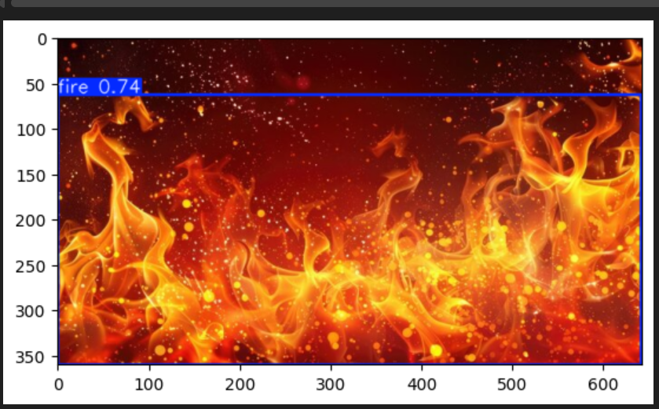

# 🛡️ FireGuard-YOLO11
### Real-Time Intelligent Fire Detection Using Deep Learning


---

## 📌 Overview

**FireGuard-YOLO11** is a real-time intelligent fire detection system designed to detect fire at an early stage and reduce the risk of large-scale damage.  
The model is trained on a **42,000+ image custom-curated dataset** using a **chunk-wise progressive training strategy**, enabling stable convergence and improved generalization.

This project focuses on:
- Early fire detection
- Low false positives
- Edge-device deployability
- Real-time inference performance

---

## 🖼️ Detection Preview



---

## 📊 Model Performance & Benchmarks

| Metric | Value |
|------|------|
| **Dataset Size** | 42,000+ Images (Custom Curated) |
| **Model Architecture** | YOLO11 Nano |
| **mAP@50** | **0.723** |
| **Precision** | **0.79** |
| **Recall** | **0.64** |
| **Inference Latency** | ~1.8 ms (Tesla P100) |
| **Final Model Size** | 5.5 MB |

> Training performed on Kaggle using Tesla P100 GPU.

---

## 🧠 Training Strategy

To efficiently train on a large dataset within compute constraints, a **multi-stage chunk-based pipeline** was used:

1. Dataset split into multiple balanced chunks
2. Initial training on individual chunks
3. Progressive weight transfer between stages
4. Final consolidated training on the combined dataset

This approach:
- Improves convergence stability  
- Reduces overfitting  
- Handles large-scale data efficiently  

---

## 🛠️ Technical Highlights

- **Edge Optimized:** Lightweight model (5.5 MB), suitable for Raspberry Pi and Jetson Nano
- **Diverse Training Data:** Indoor, outdoor, forest fire, industrial environments
- **Reduced False Positives:** Phase-wise training helps distinguish fire from fire-colored objects
- **Real-Time Ready:** Optimized for low-latency inference

---

## 📂 Project Structure

```text
├── notebooks/          # Training notebooks and logs
├── weights/            # Trained model weights (best_Final_model.pt)
├── assets/             # Evaluation plots and sample outputs
└── data.yaml           # Dataset configuration (Fire / Smoke)
```

---

## 🚀 Inference Usage

```python
from ultralytics import YOLO

# Load trained model
model = YOLO("weights/best_Final_model.pt")

# Run inference
results = model.predict(
    source="your_image.jpg",
    conf=0.5,
    save=True
)
```

---

## 🔒 Dataset Disclaimer

The dataset used for training is **private** due to licensing restrictions.  
For academic or research purposes, please open an issue to discuss access or collaboration.

---

## 🤝 Contact & Collaboration

**Ankit Kumar**

If you have questions, suggestions, or collaboration ideas, feel free to open an issue or reach out.

---

⭐ If you find this project useful, consider giving it a star!

